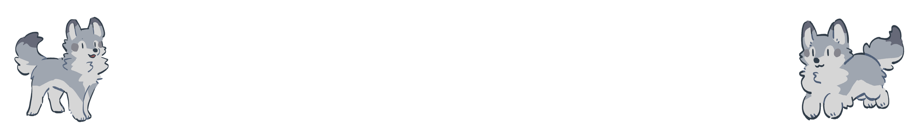

# Práctica 5. Optimización y Carga de Modelos
## Entregables
1- Importar por separado y agregar jerarquía:  
-Cuerpo  
-Mandibula inferior  
-Cada una de las 4 patas como un solo modelo  
2- Agregar rotaciones a las patas de forma independiente para que se muevan como si fuera a avanzar Goddard, limitar la rotación a 45° en Cada sentido
