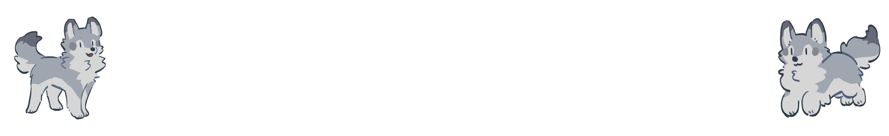

# Laboratorio de Computación Gráfica e Interacción Humano Computadora. 
Repositorio de actividades del laboratorio.

Alumno: Darwin Leonel Luna Alberto

## Prácticas
### [Práctica 1. Introducción a OpenGL](https://github.com/TorraLeo/LabGrafica2026-1/tree/Practica-01)
#### [Ejercicios de Clase](https://github.com/TorraLeo/LabGrafica2026-1/tree/Practica-01/Ejercicios%20Clase)

### [Práctica 2. Proyecciones y Puertos de Vista. Transformaciones Geométricas.](https://github.com/TorraLeo/LabGrafica2026-1/tree/Practica-02)
#### [Ejercicios de Clase](https://github.com/TorraLeo/LabGrafica2026-1/tree/Practica-02/Ejercicios%20Clase)

### [Práctica 3. Modelado Geométrico y Cámara Sintética.](https://github.com/TorraLeo/LabGrafica2026-1/tree/Practica-03)
#### [Ejercicios de Clase](https://github.com/TorraLeo/LabGrafica2026-1/tree/Practica-03/EjerciciosClase)
